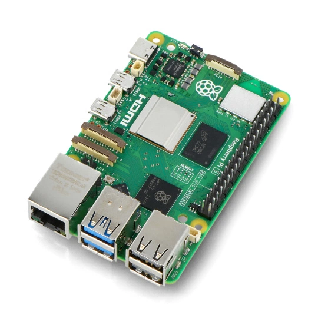
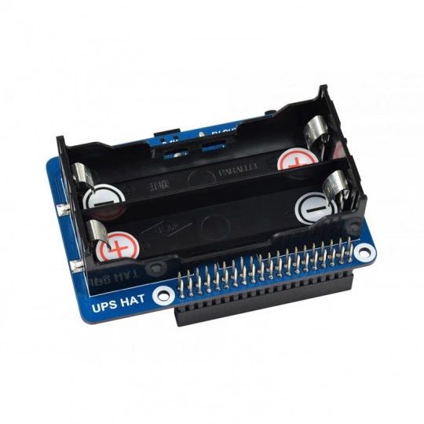
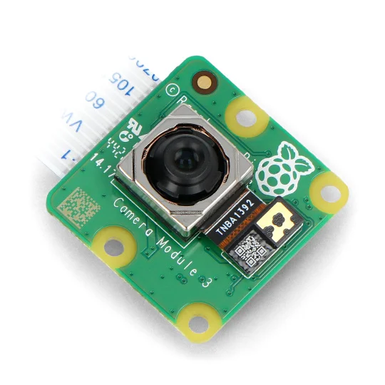
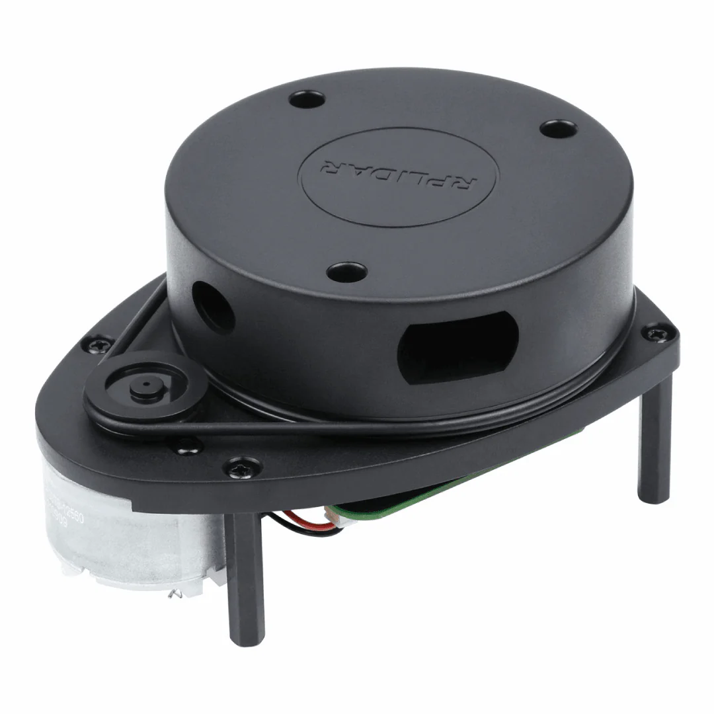
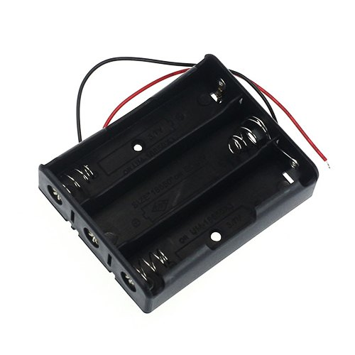
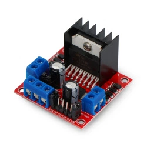
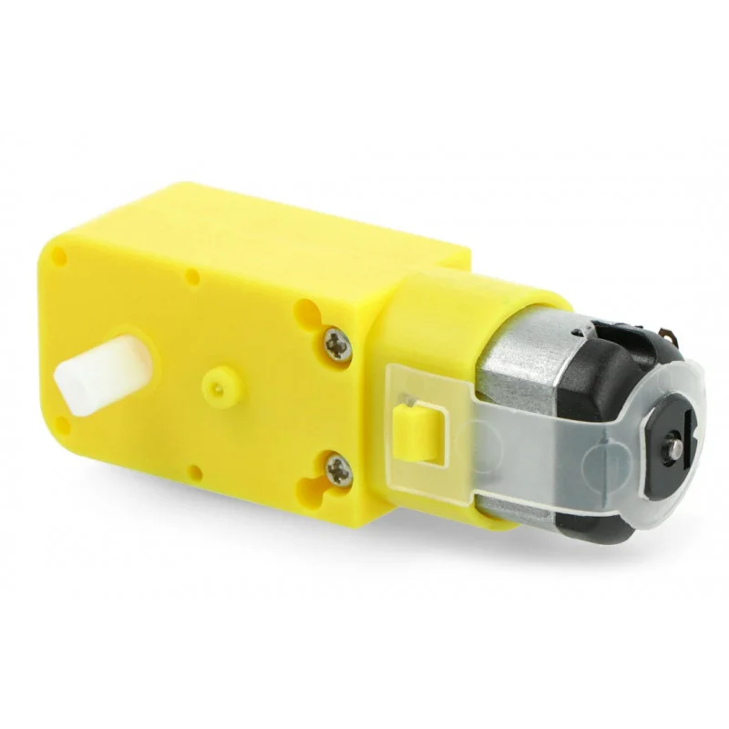
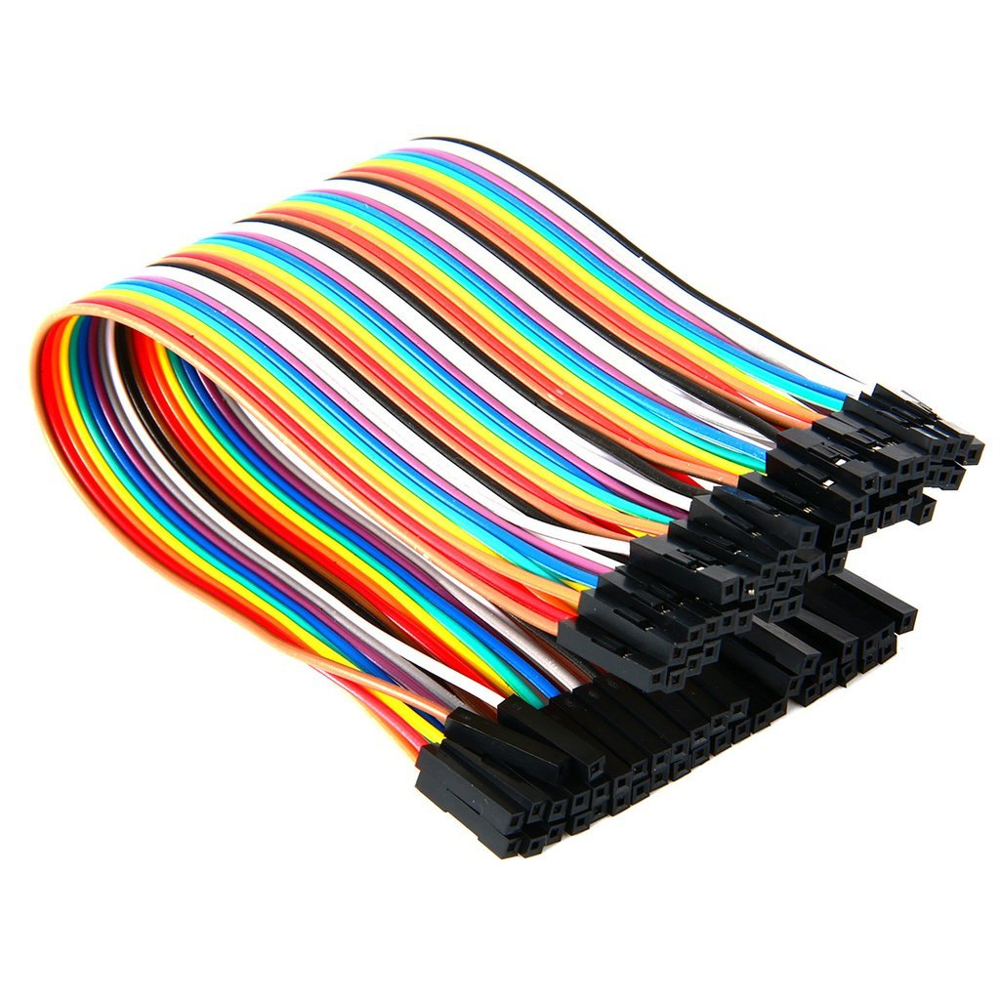
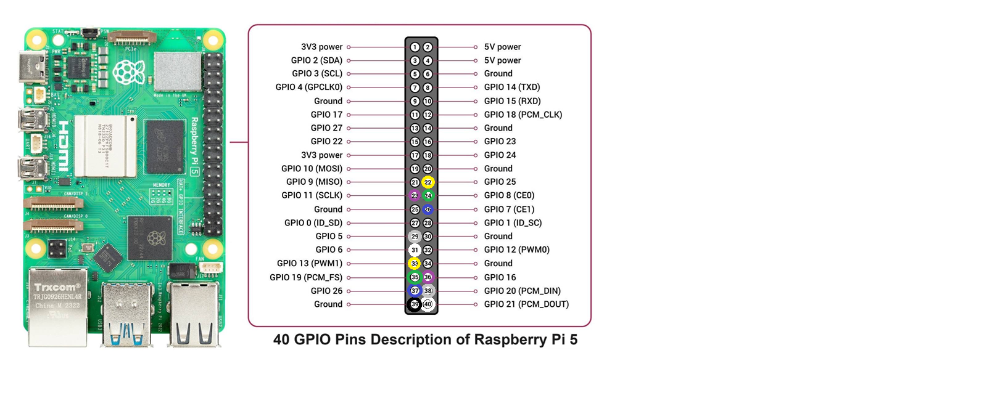
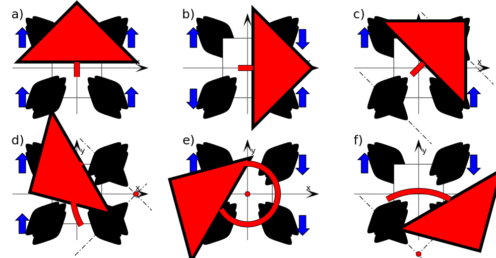

# Autonomous Car

## Table of contents
1. [Introduction](#introduction)
2. [Electronic Components](#car-components)
3. [Raspberry Pi Pinout](#raspberry-pinout)
4. [Mecanum Wheels Movement](#mecanum-wheels-movement)
5. [Web Application](#web-application)
6. [Machine Learning Model](#machine-learning-model)
7. [How to use it](#how-to-use-it)
8. [License](#license)
9. [Partnership](#partnership)
   
## Introduction 
This project integrates diverse skills such as IoT, machine learning, and more to create a system where a car is autonomously controlled by a machine learning model. The focus is on showcasing how these technologies can work together to enable intelligent, automated vehicle management.

## Electronic Components 
| Image                                   | Component Name     | Quantity |
|-----------------------------------------|--------------------|----------|
|  | Raspberry Pi 5 | 1 |
|  | Raspberry Pi 5 UPS | 1 |
|  | Raspberry Pi Camera HD v3 12MPx | 1 |
|  | RPLidar A1M8 | 1 |
|  | 18650 battery holder (3 slots) | 1 |
|  | 18650 battery | 5 |
|  | L298N motor driver | 2 |
|  | DC motor 6V (48 : 1) | 4 |
|  | Jumper wires female to female | 1 (set) |

## Raspberry Pi Pinout 

## Mecanum Wheels Movement 

### Description
A Mecanum wheel is an omnidirectional wheel design for a land-based vehicle to move in any direction. It is sometimes called the Swedish wheel or Ilon wheel after its inventor.

Movements to any directions: blue: wheel drive direction; red: vehicle moving direction. 
- a) Moving straight ahead, 
- b) Moving sideways, 
- c) Moving diagonally, 
- d) Moving around a bend, 
- e) Rotation, 
- f) Rotation around the central point of one axle.

## Web Application 
...

## Machine Learning Model 
...

## How to use it 
...

## License 
This project is licensed under the MIT License. See the LICENSE file for details.

## Partnership
Project was founded by <a href="https://www.facebook.com/sknsepgliwice/?locale=pl_PL"> the SKN SEP</a>.
