# Assembly (step by step)

## Table of contents
1. [Introduction](#introduction)
2. [Electronic components](#electronic-components)
3. [Chassis assembly](#chassis-assembly)
4. [Car assembly](#car-assembly)
5. [Raspberry pinout](#pi-pinout)

## Introduction 
The assembly process should be easy to follow. This guide is an universal standard for construction of AVs. List of components is required to meet criteria, as is the pinout. The only thing, that can differ is the placement of electronic components.

## Electronic Components 
| Image                                   | Component Name     | Quantity |
|-----------------------------------------|--------------------|----------|
| 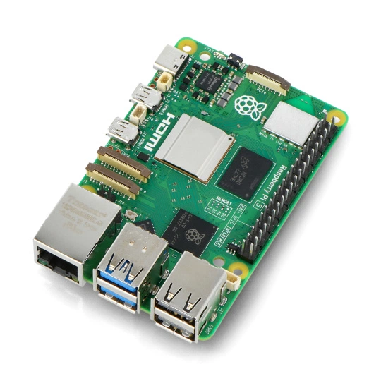 | Raspberry Pi 5 | 1 |
| 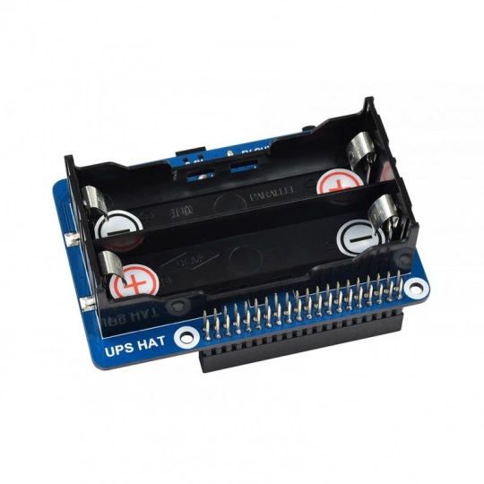 | Raspberry Pi 5 UPS | 1 |
| 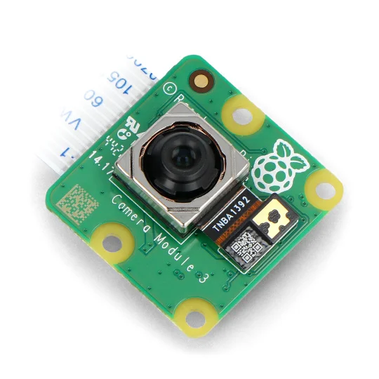 | Raspberry Pi Camera HD v3 12MPx | 1 |
| 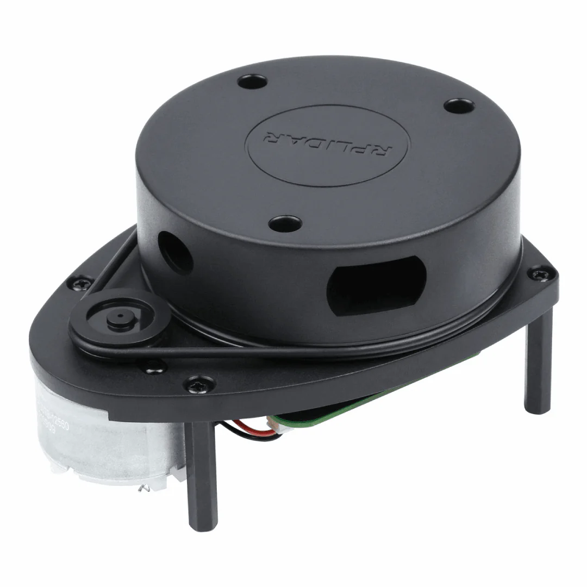 | RPLidar A1M8 | 1 |
| 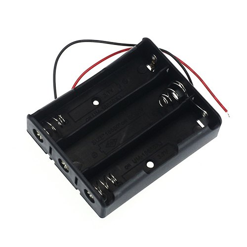 | 18650 battery holder (3 slots) | 1 |
| 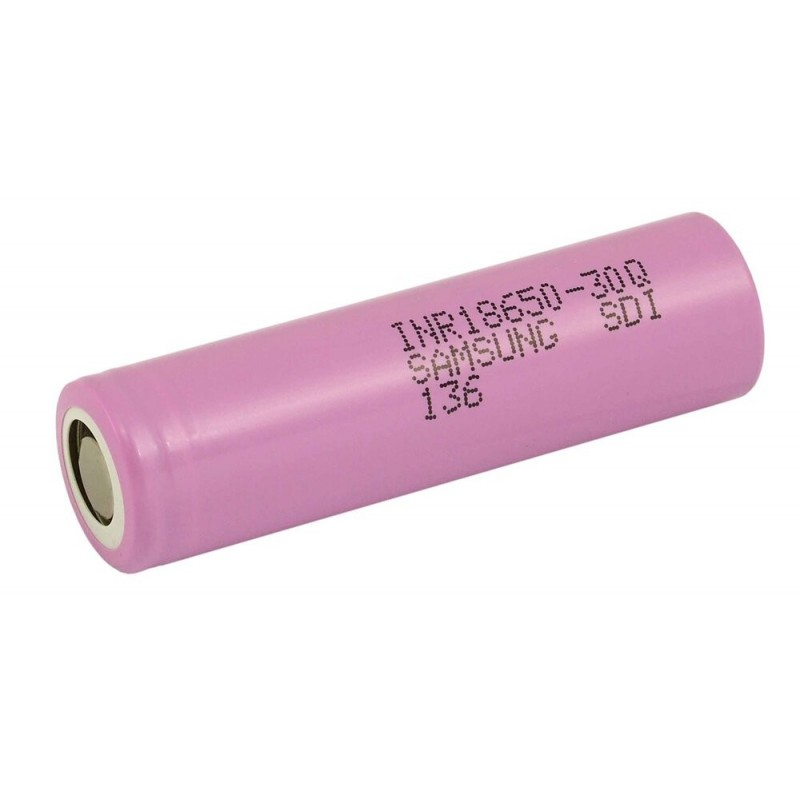 | 18650 battery | 5 |
| 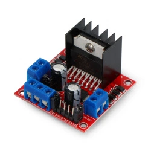 | L298N motor driver | 2 |
| 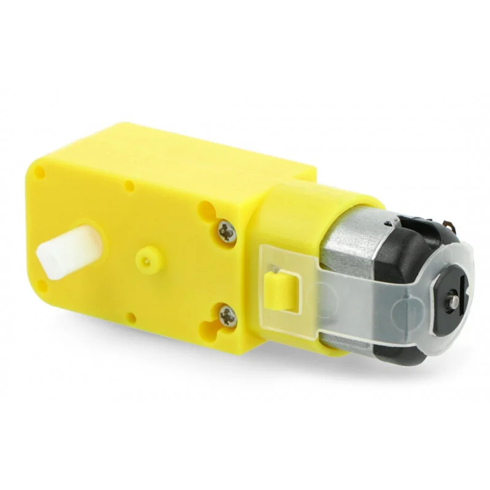 | DC motor 6V (48 : 1) | 4 |
| 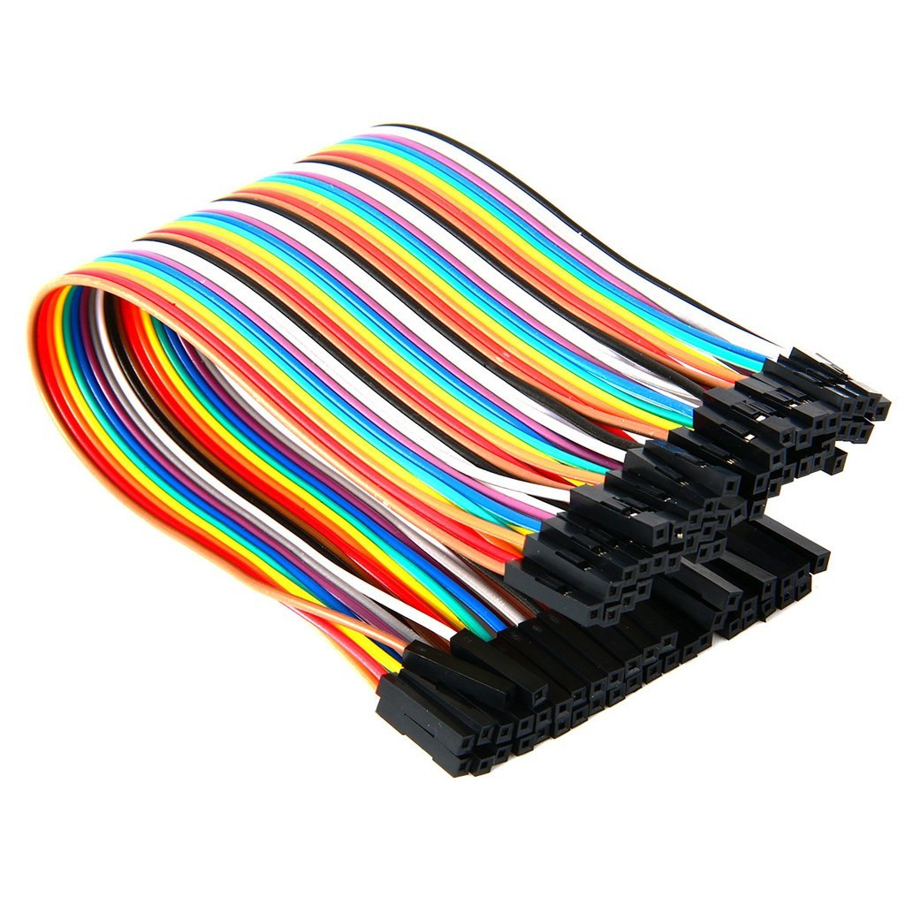 | Jumper wires female to female | 1 (set) |

## Chassis Assembly 
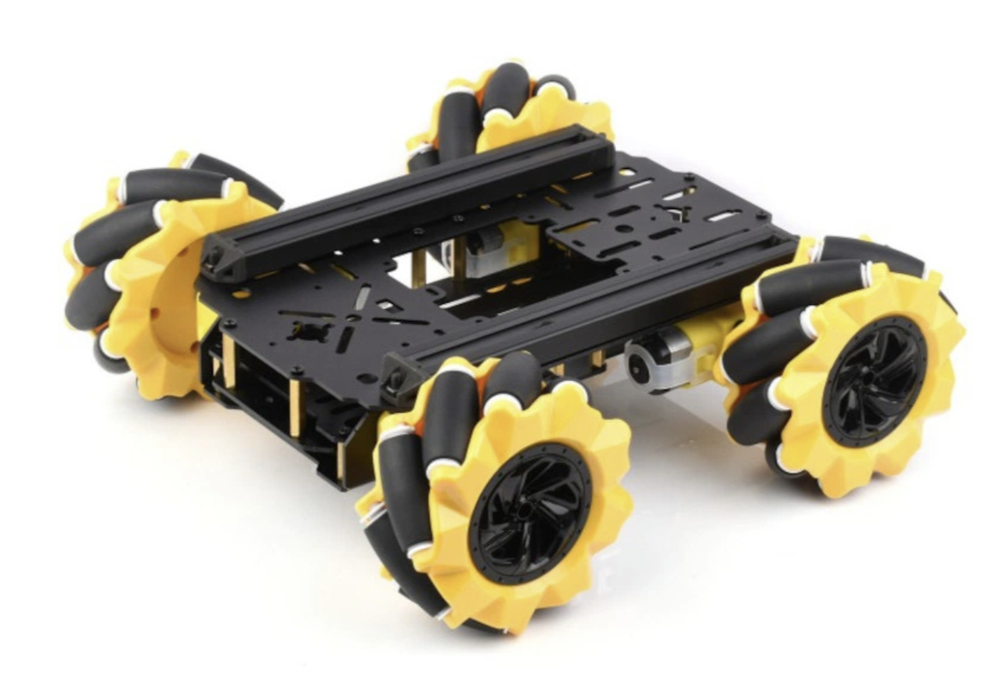

### Recommendation
In this project we have used the <a href="https://botland.com.pl/podwozia-robotow/23563-robot-chassis-mp-zestaw-inteligentnego-podwozia-robota-z-amortyzacja-mecanum-wheels-waveshare-24420.html">chassis</a> from Waveshare.

### L298N chassis tuning
 
Drill 8 holes in the chassis to mount two l298n controllers. You need to do this in order to have proper mount of l298ns.

## Car Assembly 
...

## Raspberry Pinout 
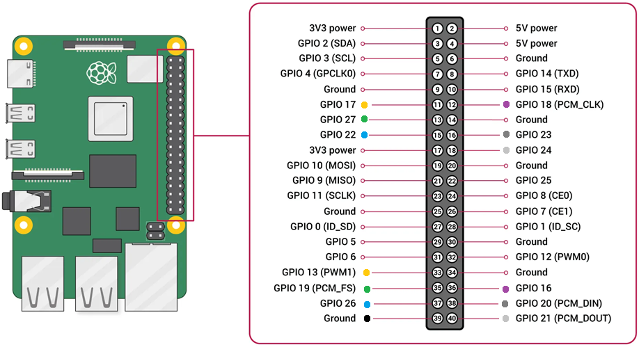

Check out <a href="https://botland.com.pl/blog/l298n-dwukanalowy-sterownik-silnikow-modul-12v-2-szczegoly-na-temat-produktu-i-przyklady-zastosowan/?cd=15425572033&ad=125523543810&kd=&gad_source=1&gclid=Cj0KCQjw4v6-BhDuARIsALprm33G4zrMTh47Ht2u4vm5Ru8ythna1aj7WtAmzYULeZFdXO5AjWesa70aAsoLEALw_wcB">l298n</a>.

### Description
- ⬛: *Ground*;
- ⬜: *ENA* controls the speed of left wheel;
- 🌫️: *IN1* spins the left motor forward;
- 🟪: *IN2* spins the left motor backward;
- 🟦: *IN3* spins the right motor forward;
- 🟩: *IN4* spins the right motor backward;
- 🟨: *ENB* controls the speed of right wheel;
